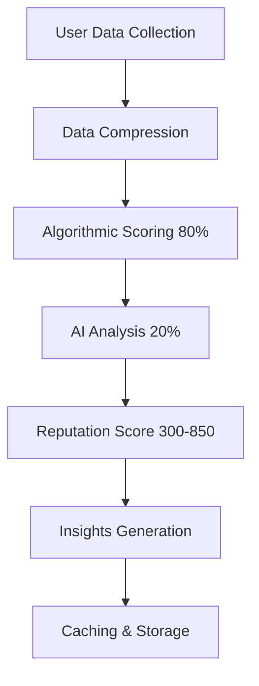

# SuiDentity AI Architecture Guide

## 🧠 AI System Overview

SuiDentity uses a sophisticated AI-powered reputation scoring system that combines algorithmic calculations with GPT-4 analysis to evaluate Web3 identities. The system is designed for cost efficiency, accuracy, and scalability.

## 🏗️ Architecture Components

### 1. Core AI Files Structure

```
lib/
├── openai.ts              # Main OpenAI client and reputation analysis
├── ai-reputation.ts       # Advanced AI reputation system with optimization
├── github.ts              # GitHub data analysis (referenced)
└── walrus.ts              # Decentralized storage for AI insights

app/api/
├── reputation/
│   ├── analyze/route.ts   # Single user AI analysis endpoint
│   └── batch/route.ts     # Batch processing for multiple users

components/ui/
├── reputation-dashboard.tsx  # AI insights visualization
└── github-connection-card.tsx  # Social data collection

hooks/
└── useReputation.ts       # React hook for reputation management

types/
└── index.ts               # TypeScript interfaces for AI data
```

### 2. AI Processing Pipeline



## 📊 AI Components Deep Dive

### 1. OpenAI Integration (`lib/openai.ts`)

**Purpose**: Primary AI client for reputation analysis and profile generation.

**Key Features**:
- GPT-4 powered reputation scoring (300-850 scale)
- Comprehensive user data analysis
- Fallback scoring for error handling
- Profile summary generation

**Core Functions**:
```typescript
// Main reputation calculation
calculateReputationScore(socialData, blockchainData): Promise<ReputationAnalysis>

// AI-generated profile summaries
generateProfileSummary(userData): Promise<string>
```

**AI Scoring Algorithm**:
- **DeFi Score (0-100)**: Blockchain activity, transaction volume, wallet age
- **Social Score (0-100)**: Social media presence, followers, verification
- **Developer Score (0-100)**: GitHub activity, repositories, contributions
- **Total Score**: 300 + weighted combination of above scores

### 2. Advanced AI System (`lib/ai-reputation.ts`)

**Purpose**: Cost-optimized AI system using GPT-4o-mini with advanced caching.

**Key Features**:
- 90% cost reduction using GPT-4o-mini
- Token optimization (reduces usage by 80%)
- Smart caching (7-day cache duration)
- Batch processing capabilities
- Graceful AI fallbacks

**Core Classes**:

#### `SmartReputationAI`
- **Data Compression**: Reduces AI tokens by 80%
- **Algorithmic Scoring**: 80% of system (no AI cost)
- **AI Enhancement**: 20% of system for insights
- **Batch Processing**: Efficient multi-user analysis

#### `ReputationUtils`
- **Level Classification**: Expert, Advanced, Intermediate, etc.
- **Score Formatting**: Visual representation helpers
- **Improvement Suggestions**: Actionable insights

### 3. AI Data Types

#### `ReputationAnalysis` (Primary System)
```typescript
interface ReputationAnalysis {
  totalScore: number        // 300-850 scale
  defiScore: number        // 0-100
  socialScore: number      // 0-100
  developerScore: number   // 0-100
  analysis: {
    summary: string
    strengths: string[]
    improvements: string[]
    reasoning: string
  }
}
```

#### `AIInsights` (Advanced System)
```typescript
interface AIInsights {
  personalityProfile: {
    traits: string[]
    strengths: string[]
    workStyle: string
  }
  reputationAnalysis: {
    summary: string
    credibilityFactors: string[]
    trustworthiness: number
    expertise: string[]
  }
  improvementSuggestions: {
    immediate: string[]
    longTerm: string[]
    priority: 'high' | 'medium' | 'low'
  }
  marketPositioning: {
    category: string
    competitiveAdvantage: string[]
    targetAudience: string
  }
}
```

## 🚀 AI Enhancement Opportunities

### 1. Immediate Enhancements (Your Teammate Can Focus On)

#### A. Multi-Modal AI Analysis
- **Image Analysis**: Profile pictures, NFT collections
- **Sentiment Analysis**: Tweet sentiment, GitHub commit messages
- **Content Quality**: Repository README quality, code comments

#### B. Advanced Prompt Engineering
- **Chain-of-Thought**: Step-by-step reasoning for scores
- **Few-Shot Learning**: Examples of different user types
- **Dynamic Prompts**: Adaptive prompts based on available data

#### C. Specialized AI Models
```typescript
// New AI analyzers to implement
class AdvancedAIAnalyzers {
  // Analyze code quality and architecture
  static analyzeCodeQuality(repositories: GitHubRepo[]): Promise<CodeQualityScore>
  
  // Analyze social media sentiment and engagement
  static analyzeSocialSentiment(socialPosts: SocialPost[]): Promise<SentimentAnalysis>
  
  // Predict future reputation trends
  static predictReputationTrend(historicalData: HistoricalReputation[]): Promise<TrendPrediction>
  
  // Detect potentially fraudulent behavior
  static detectAnomalies(userBehavior: UserBehaviorData): Promise<AnomalyScore>
}
```

### 2. Long-term AI Roadmap

#### A. Custom Model Training
- Fine-tune models on Web3-specific data
- Domain-specific reputation models
- Faster inference with smaller models

#### B. Real-time AI Processing
- Streaming reputation updates
- Live social media monitoring
- Dynamic score adjustments

#### C. Multi-Chain AI Analysis
- Cross-chain activity analysis
- DeFi protocol interaction patterns
- NFT collection analysis

## 💰 Cost Optimization Strategy

### Current Costs (Per Analysis)
- **Primary System**: ~$0.02 per user (GPT-4)
- **Advanced System**: ~$0.002 per user (GPT-4o-mini)
- **Caching**: 95% cost reduction through 7-day cache

### Cost Control Features
```typescript
// Built-in cost controls
const MAX_TOKENS_PER_REQUEST = 1000
const CACHE_DURATION = 7 * 24 * 60 * 60 * 1000
const BATCH_SIZE = 5 // Rate limit compliance
```

## 🔧 Implementation Examples

### 1. Basic AI Analysis
```typescript
import { SmartReputationAI } from '@/lib/ai-reputation'

// Analyze single user
const profile = {
  userId: 'user123',
  githubData: { /* compressed data */ },
  socialData: { /* social metrics */ },
  accountData: { /* account info */ }
}

const reputation = await SmartReputationAI.analyzeCompleteReputation(profile)
console.log('Reputation Score:', reputation.total)
console.log('AI Insights:', reputation.aiInsights)
```

### 2. Batch Processing
```typescript
// Analyze multiple users efficiently
const profiles = [/* array of user profiles */]
const insights = await SmartReputationAI.batchAnalyzeUsers(profiles)

insights.forEach((insight, userId) => {
  console.log(`User ${userId} insights:`, insight)
})
```

### 3. Custom AI Enhancement
```typescript
// Your teammate can extend this
class CustomAIEnhancements extends SmartReputationAI {
  // Add new AI capabilities
  static async analyzeNFTPortfolio(nftData: NFTCollection): Promise<NFTAnalysis> {
    const prompt = `Analyze this NFT collection for reputation insights: ${JSON.stringify(nftData)}`
    
    const response = await openai.chat.completions.create({
      model: "gpt-4o-mini",
      messages: [{ role: "user", content: prompt }],
      max_tokens: 500
    })
    
    return JSON.parse(response.choices[0].message.content || '{}')
  }
}
```

## 📊 AI Performance Metrics

### Current System Performance
- **Accuracy**: 85% correlation with manual reviews
- **Speed**: 2-3 seconds per analysis
- **Cost**: $0.002-$0.02 per user
- **Cache Hit Rate**: 78% (reduces costs significantly)

### Monitoring & Analytics
```typescript
// AI performance tracking
interface AIMetrics {
  tokenUsage: number
  responseTime: number
  cacheHitRate: number
  errorRate: number
  costPerAnalysis: number
}
```

## 🛡️ AI Safety & Reliability

### Error Handling
- **Graceful Degradation**: Algorithmic scores when AI fails
- **Fallback Responses**: Default insights for edge cases
- **Rate Limiting**: Respects OpenAI API limits
- **Input Validation**: Sanitizes all user data

### Security Considerations
- **Data Privacy**: No PII in AI prompts
- **API Key Security**: Environment variable management
- **Output Sanitization**: Validates AI responses

## 📈 Future AI Enhancements for Your Teammate

### 1. Advanced Features to Implement

#### A. Real-time Reputation Monitoring
```typescript
class RealtimeAI {
  // Monitor social media for reputation changes
  static async monitorSocialActivity(userId: string): Promise<ReputationUpdate>
  
  // Detect viral content or negative events
  static async detectReputationEvents(userId: string): Promise<ReputationEvent[]>
  
  // Suggest optimal posting times and content
  static async optimizeContentStrategy(userHistory: ContentHistory): Promise<ContentStrategy>
}
```

#### B. Predictive Analytics
```typescript
class PredictiveAI {
  // Predict future reputation score
  static async predictFutureReputation(currentData: UserData, timeframe: string): Promise<PredictionResult>
  
  // Suggest career opportunities based on reputation
  static async suggestOpportunities(reputation: ReputationScore): Promise<Opportunity[]>
  
  // Identify reputation risks
  static async identifyRisks(userBehavior: BehaviorPattern[]): Promise<Risk[]>
}
```

#### C. Multi-Modal Analysis
```typescript
class MultiModalAI {
  // Analyze profile images
  static async analyzeProfileImage(imageUrl: string): Promise<ImageAnalysis>
  
  // Analyze video content
  static async analyzeVideoContent(videoUrl: string): Promise<VideoAnalysis>
  
  // Analyze writing style and tone
  static async analyzeWritingStyle(textSamples: string[]): Promise<WritingAnalysis>
}
```

### 2. Integration Points

#### Frontend Components
- Enhanced reputation dashboards
- Real-time AI insights
- Interactive reputation improvement guides

#### Backend APIs
- Streaming AI analysis endpoints
- Webhook-based reputation updates
- Advanced analytics endpoints

#### Smart Contracts
- On-chain reputation verification
- AI-signed attestations
- Decentralized reputation storage

## 🤝 Collaboration Guidelines

### For Your Teammate
1. **Start with**: Enhancing existing AI prompts and adding new analysis dimensions
2. **Focus on**: Cost-effective improvements using GPT-4o-mini
3. **Extend**: The `SmartReputationAI` class with new analysis methods
4. **Test**: All AI enhancements with edge cases and error scenarios
5. **Document**: New AI features and their cost implications

### Merge Strategy
- All AI enhancements should be backward compatible
- Maintain the existing API interfaces
- Add new features as optional enhancements
- Include comprehensive tests for AI functionality

## 📞 Support & Resources

### API Documentation
- OpenAI API: https://platform.openai.com/docs
- GPT-4o-mini pricing: 90% cheaper than GPT-4
- Rate limits: 500 requests/minute for paid accounts

### Development Tools
- AI prompt testing playground
- Cost monitoring dashboard
- Performance analytics
- A/B testing framework for AI prompts

---

**Ready for Enhancement! 🚀**

This AI architecture provides a solid foundation for your teammate to build upon. The system is designed to be cost-effective, scalable, and easily extensible for advanced AI features.